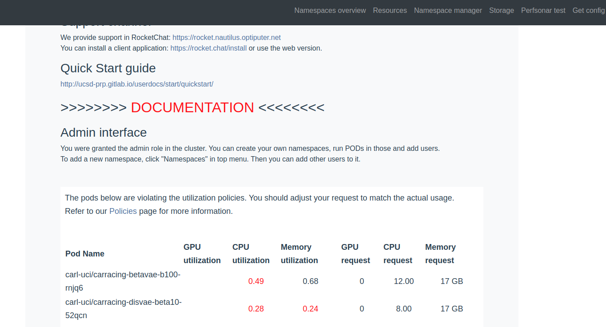

## Lesson3: Use Jobs
So we have learned pods and persistent volumes. The last important thing to learn is jobs. The problem of pods is that the release of computing resources for pods relies on manual deleting of pods. If you forget to delete them, the pods will always be there and may cause waste of computing resources. As a result, the admins of CHASE-CI limit the usage of pods. You could only apply for a limited amount of computing resource (1GPU, 2CPUs, 8G Memory) for a limited time (6 hours). If your task goes beyond that, you have to use jobs. The running of jobs also relies on pods. Besides the pod, a job also defines the commands that you want to run in the pod. When the pod is created, those commands will be exectutated automatically. Once the commands to run have finished, the job will become **Completed** and the computing resources will be released automatically. So always remember to save the result to persistent volumes in jobs, otherwise you will lose them.  

Let's run 
```
kubectl create -f scripts/l3_job.yaml
```
So we just created a job. Since the commands to run is very simple, the job will be completed in a very short time. In this job, we cloned this repo to the persistent volume and ran a python script to write a file to the volume. These commands are defined in **args** of the yaml file.
```
args: ["git clone https://github.com/KarlXing/CHASE-CI-Tutorial.git  /pv/CHASE-CI-Tutorial;
        cd /pv/CHASE-CI-Tutorial;
        python scripts/l1.py;"]
```

In the job yaml file, we wrapped the **spec** of containers under the **sepc** of a job. **template** is the only required field of the **spec** of the job. ```.spec.template``` is a pod template. It has exactly the same schema as a Pod, except it is nested and does not have an apiVersion or kind. It's okay to use *l3_job.yaml* as a job template and just change needed fields to satisfy your task requirements. You could refer to https://kubernetes.io/docs/concepts/workloads/controllers/job/#running-an-example-job for more details.

```
spec:
  template:
    spec:
      containers:
      - name: container-name
```

Once the job is done, the file would have been wrote to the persistent volume. To get the file, you might need to create a pod with that volume mounted and use **kubectl cp** to download it to your local machine (as demonstrated in Lesson 1 & 2). 

Sometimes, you may have a problem of submitting a job and get an error like 
> Error from server: error when creating "scripts/l3_job.yaml": admission webhook "job.nautilus.optiputer.net" denied the request: Your pods resources utilization is too low. See your stats at https://nautilus.optiputer.net for details.

It means that your job didn't fully use the resources it requested. As it said, you could see the resoruces usage from https://nautilus.optiputer.net. For example, you could see . The red font indicates that the utilization was not enough. Normally, you need to delete the current job, adjust the amount of requested resources and submit again. Another source that you can check the usgae of pods/jobs under your namespace is https://grafana.nautilus.optiputer.net/. 


Great! For now, we have learned pods, persistent volumes and jobs. Now you should be able to use CHASE-CI to do most work. Congratulations! 
